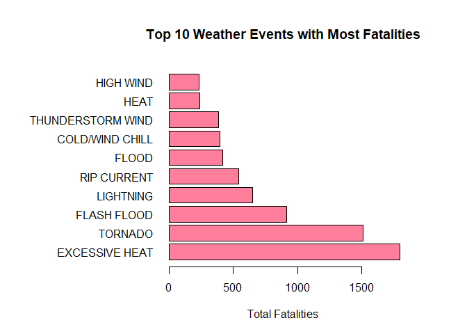
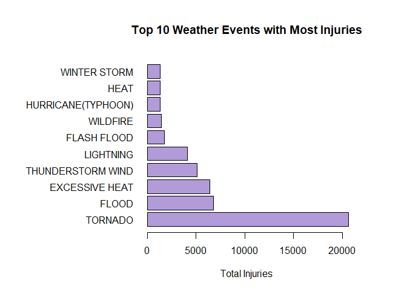
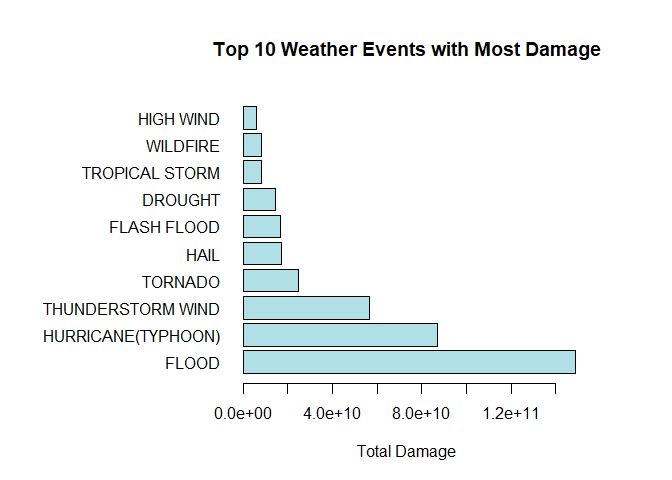

# Synopsis
Storms and other severe weather events can cause both public health and economic
problems for communities and municipalities. Many severe events can result in
fatalities, injuries, and property damage, and preventing such outcomes to the
extent possible is a key concern.

This project involves data from the US National Oceanic and Atmospheric Association
(NOAA) storm database. In this project, I extract and tidy up the data to make
a proper analysis to answer the following questions:

1. Which types of events are most harmful with respect to public health?
2. Which types of events have the greatest economic consequences?

# Data Processing
## Loading the data

I downloaded the data from [here](https://d396qusza40orc.cloudfront.net/repdata%2Fdata%2FStormData.csv.bz2)
using the following code:


```r
dataurl <- "https://d396qusza40orc.cloudfront.net/repdata%2Fdata%2FStormData.csv.bz2"
datafile <- "data.csv.bz2"
download.file(dataurl, datafile)
```

I then loaded the data into the workspace using the following code:


```r
datafile <- "data.csv.bz2"
stormdata <- read.csv(datafile)
```

With the data loaded into the workspace, I then set to tidy up the data set.

## Tidying the Data

I made use of the following libraries for the tidying process:


```r
library(dplyr)
library(stringr)
```

According to [NOAA](https://www.ncdc.noaa.gov/stormevents/details.jsp?type=eventtype),
NOAA only started to record all weather event types from 1996 onwards. Therefore,
to make a fairer evaluation of which weather events caused the most impact, I
decided to extract records from 1996 onwards:


```r
tidydata <- mutate(stormdata,
                   Year = as.numeric(format(as.Date(stormdata$BGN_DATE, format = "%m/%d/%Y %H:%M:%S"), "%Y")))
tidydata <- filter(tidydata, Year > 1995)
```

By doing so, I remove any possible skewing/bias in the data as a result of having
too many records of that event type (i.e. Tornado, Thunderstorm Wind, Hail).

Afterwards, I converted the values within `PROPDMGEXP` and `CROPDMGEXP` into their
equivalent values, as seen below:


```r
exponents <- data.frame(sort(unique(tidydata$PROPDMGEXP)))
exponents <- cbind(exponents, c(0, 10^0, 10^9, 10^3, 10^6))
colnames(exponents) <- c("identifier", "value")
tidydata$PROPDMGEXP <- exponents$value[match(tidydata$PROPDMGEXP, exponents$identifier)]
tidydata$CROPDMGEXP <- exponents$value[match(tidydata$CROPDMGEXP, exponents$identifier)]
```

I then merged the `PROPDMG`/`CROPDMG` with their equivalent exponent columns using
the following code:


```r
tidydata <- tidydata %>%
        mutate(PropertyDmg = PROPDMG * PROPDMGEXP,
               CropDmg = CROPDMG * CROPDMGEXP) %>%
        select(-(c(PROPDMG, PROPDMGEXP, CROPDMG, CROPDMGEXP)))
```

Now comes the tedious part. As over time people may commit typos or record things
into the database differently, instead of the 48 Event types listed [here](https://d396qusza40orc.cloudfront.net/repdata%2Fpeer2_doc%2Fpd01016005curr.pdf),
if I were to list the number of (unique) weather event types in our current data
set, I would get the following value:


```r
length(unique(tidydata$EVTYPE))
```

```
## [1] 516
```

...which is far from 48.

I thus created a script to convert the `EVTYPE`s to their proper names:


```r
source("EVType_fixer.R")
```
*note: you can find the full `EVType_fixer.R` script*
*[here](https://github.com/MarielM93/RepData_PeerAssessment2/blob/master/EVType_fixer.R)*


I then classified all other weather events not included in the list of 48 as 
`OTHERS` and removed `SUMMARY` values using the following code:


```r
events <- c("ASTRONOMICAL LOW TIDE", "AVALANCHE", "BLIZZARD", "COASTAL FLOOD", 
            "COLD/WIND CHILL", "DEBRIS FLOW", "DENSE FOG", "DENSE SMOKE", 
            "DROUGHT", "DUST DEVIL", "DUST STORM", "EXCESSIVE HEAT", 
            "EXTREME COLD/WIND CHILL", "FLASH FLOOD", "FLOOD", "FROST/FREEZE", 
            "FUNNEL CLOUD", "FREEZING FOG", "HAIL", "HEAT", "HEAVY RAIN", "HEAVY SNOW", 
            "HIGH SURF", "HIGH WIND", "HURRICANE(TYPHOON)", "ICE STORM", "LAKE-EFFECT SNOW", 
            "LAKESHORE FLOOD", "LIGHTNING", "MARINE HAIL", "MARINE HIGH WIND", 
            "MARINE STRONG WIND", "MARINE THUNDERSTORM WIND", "RIP CURRENT", "SEICHE", 
            "SLEET", "STORM SURGE/TIDE", "STRONG WIND", "THUNDERSTORM WIND", "TORNADO", 
            "TROPICAL DEPRESSION", "TROPICAL STORM", "TSUNAMI", "VOLCANIC ASH", "WATERSPOUT", 
            "WILDFIRE", "WINTER STORM", "WINTER WEATHER", "SUMMARY")
### Removing summary values
tidydata <- tidydata %>%
        mutate(EVTYPE = ifelse(EVTYPE %in% events, EVTYPE, "OTHERS")) %>%
        filter(EVTYPE != "SUMMARY")
```

...Which thus leaves me with this much unique values in `EVTYPE`


```r
length(unique(tidydata$EVTYPE))
```

```
## [1] 46
```

...Not quite close to 48, but close enough to make a proper analysis of.

Thus, I proceeded to split and analyse the data.

## Analysing the data
### Analysing the Public Health Impact

To find out which weather event had the most public health impact, we would thus
need to look at the `FATALITIES` and `INJURIES` columns of the data set. I extracted
these columns and grouped them by weather event type, then calculated the overall
total for each weather event. This was done using the following code:


```r
stormfatal <- tidydata %>%
        select(EVTYPE, FATALITIES) %>%
        group_by(EVTYPE) %>%
        summarise(TotalFatalities = sum(FATALITIES)) %>%
        arrange(desc(TotalFatalities))

storminj <- tidydata %>%
        select(EVTYPE, INJURIES) %>%
        group_by(EVTYPE) %>%
        summarise(TotalInjuries = sum(INJURIES)) %>%
        arrange(desc(TotalInjuries))
```

I only wanted to extact the top 10 for both data sets, which was done as such:


```r
fatal10 <- head(stormfatal, 10)
inj10 <- head(storminj, 10)
```

### Analysing the Economic Impact

For economic impact, we must look into the combined costs incurred from `PropertyDmg`
and `CropDmg`. I extracted the two `Dmg` columns and summated these two together. 
Similar to the data sets for public health, I grouped the data by weather event 
type, then calculated the overall damage costs for each weather event, using the 
code below:


```r
stormdmg <- tidydata %>%
        select(EVTYPE, PropertyDmg, CropDmg) %>%
        mutate(OverallDmg = PropertyDmg + CropDmg) %>%
        group_by(EVTYPE) %>%
        summarise(TotalDmg = sum(OverallDmg)) %>%
        arrange(desc(TotalDmg))
```

I was also only interested in the top 10 events for economic impact, so I extracted
the top 10 using the code below:


```r
dmg10 <- head(stormdmg, 10)
```

# Results
## Which types of events are the most harmful with respect to public health?

As mentioned previously, two variables determine the impact to public health.

First, for `FATALITIES`, the top 10 events with the greatest number of fatalities
are represented graphically below:


```r
par(mai=c(1,2.5,1,1))
barplot(fatal10$TotalFatalities, 
        names.arg = fatal10$EVTYPE, 
        xlab = "Total Fatalities", 
        col = "#FE7F9C", 
        main = "Top 10 Weather Events with Most Fatalities", 
        horiz = TRUE, 
        las = 1)
```

<!-- -->

From the graph above, `EXCESSIVE HEAT` had the highest number of fatalities,
followed closely by `TORNADO`. `FLASH FLOOD` came in third, albeit with
significantly lesser fatalities compared to `TORNADO` and `EXCESSIVE HEAT`.

For `INJURIES`, the top 10 events with the greatest nummber of injuries are
as represented below:


```r
par(mai=c(1,2.5,1,1))
barplot(inj10$TotalInjuries, 
        names.arg = inj10$EVTYPE, 
        xlab = "Total Injuries", 
        col = "#B19CD9", 
        main = "Top 10 Weather Events with Most Injuries", 
        horiz = TRUE, 
        las = 1)
```

<!-- -->

`TORNADO` had the highest number of injuries, and was significantly higher than
the rest of the weather events in the top 10 list. This was followed by `FLOOD` 
and `EXCESSIVE HEAT`.

## Which types of events had the greatest economic consequences?

The top 10 events which had the highest economic damage are represented in the
graph below:


```r
par(mai=c(1,2.5,1,1))
barplot(dmg10$TotalDmg, 
        names.arg = dmg10$EVTYPE, 
        xlab = "Total Damage", 
        col = "#B0DFE5", 
        main = "Top 10 Weather Events with Most Damage", 
        horiz = TRUE, 
        las = 1)
```

<!-- -->

As seen above, `FLOOD`s have caused the greatest economic damage, followed by
`HURRICANE(TYPHOON)` and `THUNDERSTORM WIND`.

# Conclusions

Events such as Excessive Heat, Tornadoes, and Floods cause the greatest impact
overall in terms of public health. Fatalities reported for Excessive Heat are
likely resulting from Heat-related conditions such as heatstroke, which can be 
fatal if not managed in time. Fatalities and injuries for Tornadoes are likely
resulting from injuries from impact from debris from the high-speed tornado
winds, or from the strong winds themselves. Floods can give way to a host of 
water-borne illnesses, which may be behind the injuries and fatalities reported
in the database for this event type.

Weather events such as Floods, Hurricanes/Typhoons, and Thunderstorm winds can 
actually be interlinked and cause the most property damage. These weather events
may cause structures to be knocked over or leave crop fields waterlogged and 
unusable for days - leading to massive losses from crop damage.

# Additional notes

The full analysis code can be found
[here](https://github.com/MarielM93/RepData_PeerAssessment2/blob/master/run_analysis.R).

The full EVType substitution code can be found
[here](https://github.com/MarielM93/RepData_PeerAssessment2/blob/master/EVType_fixer.R).

This analysis was run on `R version 3.6.1 (2019-07-05)` on Windows 10 64-bit
edition.

Packages `dplyr` v0.8.3 and `stringr` v1.4.0 were used in this analysis.
